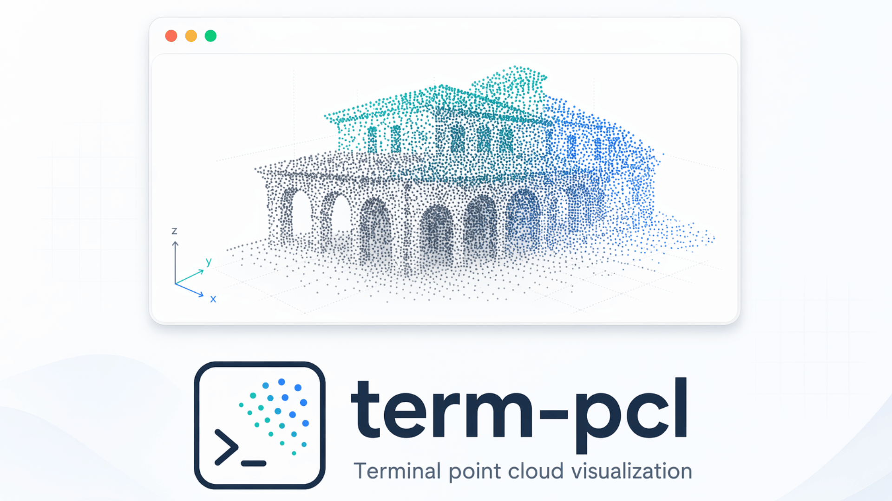
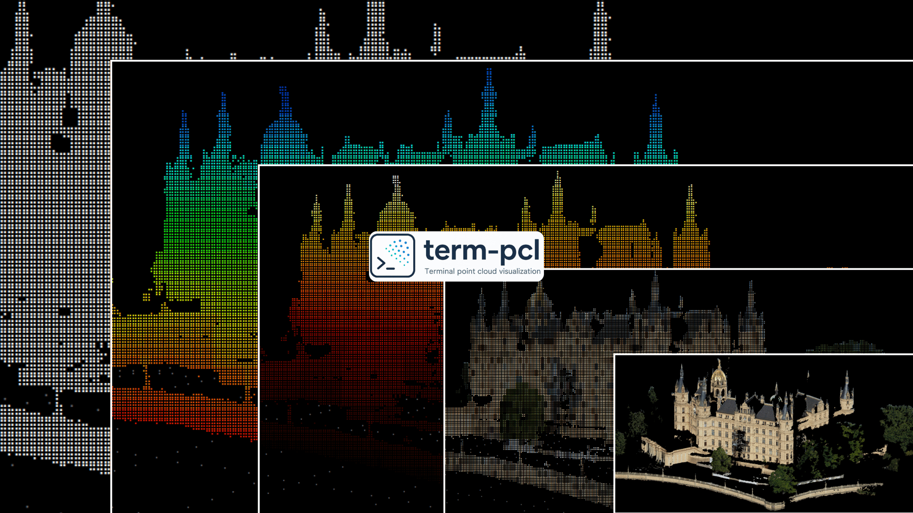

# term-pcl



> Fast terminal point-cloud visualization for Linux.

`term-pcl` is a native command-line point-cloud viewer that loads common point-cloud formats and renders them directly in the terminal with an interactive FTXUI interface. It is designed for quick inspection, remote-machine workflows, and large point-cloud navigation.



## Highlights

- Native Linux CLI: install and run `term-pcl` as a system command.
- Common formats: `.pcd`, `.ply`, `.xyz`, `.xyzn`, `.xyzrgb`, and `.termcloud`.
- RGB rendering: PLY, PCD, and XYZRGB clouds can use stored per-point colors.
- Viewer color presets: RGB, elevation, x-axis, white, rainbow, turbo, viridis, heat, and grayscale.
- Large-cloud workflow: point budgets, voxel downsampling, profiling, reusable `.termcloud` indexes, hierarchical LOD, lazy chunk streaming, and cache-aware refinement.
- Terminal UI: full-screen controls, z-buffering, adaptive splatting, HUD stats, and smooth refresh.

## Requirements

`term-pcl` is currently focused on Linux terminal environments. Source builds need:

- CMake 3.16 or newer
- A C++17 compiler
- PCL development libraries
- Git and CA certificates when using CMake's FTXUI fetch fallback
- Debian packaging tools only when building `.deb` packages

On Ubuntu/Debian:

```bash
sudo apt update
sudo apt install cmake g++ make libpcl-dev git ca-certificates
```

## Install

### From a Debian package

```bash
sudo apt install ./term-pcl_0.1.0-1_amd64.deb
```

### From source

From the repository root:

```bash
cmake -S . -B build -DCMAKE_BUILD_TYPE=Release
cmake --build build --parallel
ctest --test-dir build --output-on-failure
sudo cmake --install build
```

If your system does not provide FTXUI as a package, the default CMake configuration can fetch FTXUI during configure. Package builds disable that fallback so dependency resolution remains explicit.

## Usage

Open a point cloud:

```bash
term-pcl cloud.pcd
term-pcl cloud.ply
term-pcl cloud.xyz
term-pcl cloud.xyzrgb
```

Validate a file without opening the UI:

```bash
term-pcl --check cloud.pcd
term-pcl --check cloud.termcloud
```

Choose a color mode:

```bash
term-pcl logo.ply --color rgb
term-pcl map.pcd --color elevation
term-pcl map.pcd --color turbo
term-pcl map.xyz --color white
```

Tune large-cloud rendering:

```bash
term-pcl --point-budget 50000 map.pcd
term-pcl --voxel-size 0.2 map.pcd
term-pcl --check --profile map.pcd
```

Create and reuse a `.termcloud` hierarchy:

```bash
term-pcl index map.pcd --output map.termcloud --voxel-size 0.2 --point-budget 500000
term-pcl --point-budget 50000 map.termcloud
term-pcl --check --profile map.termcloud
```

`term-pcl index` refuses to overwrite an existing output directory by default. Use `--force` only when you intentionally want to replace an existing `.termcloud` directory:

```bash
term-pcl index map.pcd --output map.termcloud --force
```

## Supported formats

| Format | Notes |
| :--- | :--- |
| `.pcd` | Loaded through PCL. RGB fields are used when available. |
| `.ply` | Loaded through PCL. RGB fields are used when available. |
| `.xyz` | Text XYZ points. |
| `.xyzn` | Text XYZ points with normals; normals are ignored for rendering. |
| `.xyzrgb` | Text XYZ points with RGB color channels. |
| `.termcloud` | Native indexed hierarchy for large point clouds. |

## Color modes

Use `--color MODE` with one of:

| Mode | Use case |
| :--- | :--- |
| `rgb` | Stored per-point RGB from PLY, PCD, or XYZRGB. |
| `elevation` | Height-based scalar coloring. |
| `x` | X-axis spatial gradient. |
| `white` | Single-color inspection mode. |
| `rainbow` | High-contrast scalar ramp. |
| `turbo` | Perceptually strong scalar ramp. |
| `viridis` | Colorblind-friendly scalar ramp. |
| `heat` | Warm intensity-style ramp. |
| `grayscale` | Monochrome scalar ramp. |

## Keybindings

| Key | Action |
| :--- | :--- |
| `W` / `S` | Orbit up / down |
| `A` / `D` | Orbit left / right |
| `P` / `;` | Roll clockwise / counter-clockwise |
| `+` / `-` | Zoom in / out |
| Arrow keys | Pan left / right / up / down |
| `PgUp` / `PgDn` | Move forward / backward |
| `1` / `2` / `3` | Camera presets |
| `R` | Reset camera and splatting |
| `C` | Toggle camera mode |
| `M` | Cycle color mode |
| `[` / `]` | Decrease / increase splatting |
| `Q` / `Esc` | Quit |

## Build a Debian package

```bash
sudo apt install debhelper-compat devscripts
DEB_BUILD_OPTIONS=nocheck dpkg-buildpackage -us -uc -b
sudo apt install ../term-pcl_0.1.0-1_*.deb
```

## Limitations

- Linux is the supported target platform for this release.
- Rendering quality depends on terminal size, font metrics, and color support.
- Very large clouds should use point budgets, voxel downsampling, or `.termcloud` indexes.
- `.termcloud` is a project-native format intended for fast reuse by `term-pcl`; keep original source point-cloud files as the durable source of truth.

## Contributing

Contributions are welcome. See [CONTRIBUTING.md](CONTRIBUTING.md) for build, test, and pull request guidance.

## Security

Please report security issues privately using the process in [SECURITY.md](SECURITY.md). Malformed point-cloud inputs, unsafe filesystem behavior, and parser crashes are treated as security-relevant reports.


## Credits

`term-pcl` is inspired by Nathan Shankar's [`terminal_pcl_visualizer`](https://github.com/nathanshankar/terminal_pcl_visualizer) project.

## Maintainer

Robolabs AI <contact@robolabs.ai>


## License

`term-pcl` is released under the BSD 3-Clause License. See [LICENSE](LICENSE).
